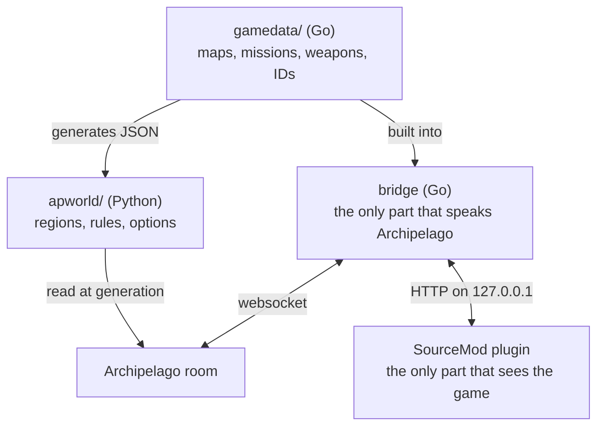

# The repository

What each directory holds, why Mann vs Machine is the mode this works in, and
the commands that build it.

## Why Mann vs Machine

MvM is the only TF2 mode with progress built into it:

- A mission is an ordered series of waves.
- A team clears a wave, or fails it.
- A shop sells upgrades that persist.
- A round is an ordered series of missions.

That structure maps onto Archipelago's regions and locations directly. Classic
TF2 has none of it: no order, no gate, nothing that stays won.

## The three processes



The SourceMod plugin is the only part that sees the game. The Go bridge is the
only part that speaks Archipelago. `gamedata/`, in Go, is the only part that
knows what a mission or a weapon is. It exports that knowledge as JSON, and the
Python apworld reads the JSON when it generates a seed.

The Windows launcher runs the bridge in-process beside the game server. The
compose stack runs them as two containers. Players connect with a stock TF2
client and install nothing.

[ADR 0001](./adr/0001-go-owns-the-game-data.md) and
[ADR 0002](./adr/0002-server-side-plugin-with-a-go-bridge.md) say why it is
split this way and what the alternatives cost.

## The directories

| Directory | Language | Role |
| --- | --- | --- |
| `gamedata/` | Go | Source of truth: maps, missions, waves, weapons, upgrades, robots, and the IDs. Exports the JSON. |
| `bridge/` | Go | Archipelago client. WebSocket, reconnection, a durable queue, and a loopback HTTP API for the plugin. |
| `fakeroom/` | Go | The multiworld of one that test mode serves, with simulated players. |
| `apworld/` | Python | A thin apworld. It reads the exported JSON and sets the regions, the rules, and the YAML options. |
| `plugin/` | SourcePawn | Detects the objectives. Applies the unlocks. |
| `launcher/` | Go | The Windows exe: a window over the bridge and the game server, the installer, the seed generator's driver. |
| `deploy/` | Compose, shell | The images, the compose files, and the build of the defender bots. |
| `docs/` | Markdown | The book, in English and French. Spec, ADRs, prior art, and the original Discord thread. |

## Building it

`make help` lists every target. These are the ones used most:

```sh
make check        # everything CI runs
make integration  # real Archipelago and bridge, driven the way the plugin drives them
make launcher     # cross-compile tf2ap.exe into dist/
make bots         # stage the defender bots the image and the exe carry
```

Every version this project pins is in `deploy/env/versions.env`, except the Go
version, which is the `go` line in `go.mod` because that directive must be a
literal.
