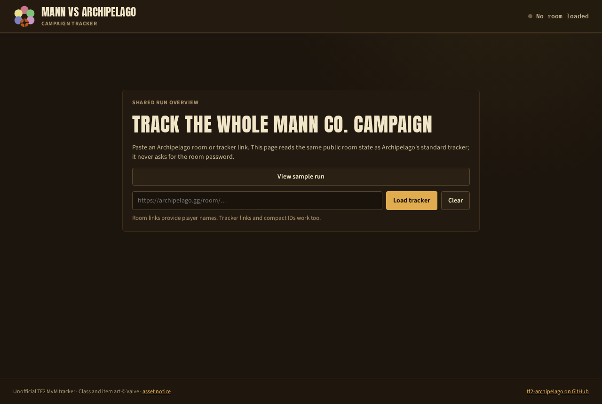
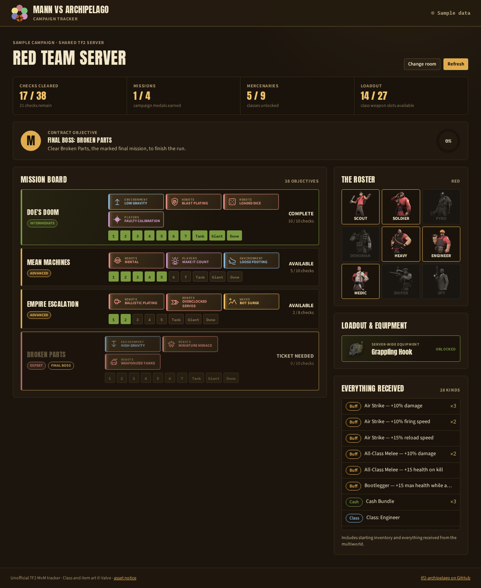
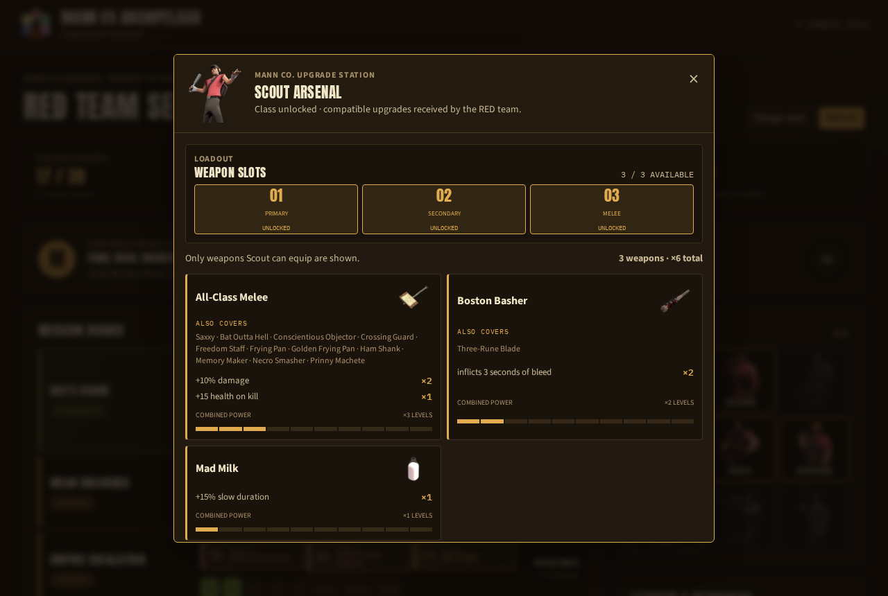

# Le tracker de campagne

Le tracker est une page web qui montre toute la partie. Elle montre les
missions, les classes, les emplacements d'arme, les bonus, et à quelle
distance l'équipe est de l'objectif. Toute personne qui a le lien de la room peut l'ouvrir. Personne
n'installe rien, et la page ne demande jamais le mot de passe de la room.

Ouvrez-le sur
[m-this.github.io/tf2-archipelago/tracker](https://m-this.github.io/tf2-archipelago/tracker/).

## Charger une partie

1. Copiez le lien de la room depuis `archipelago.gg`, celui que vous avez
   donné au lanceur. Le lien du tracker de la room ou son identifiant court
   marchent aussi.
2. Collez-le dans le champ et appuyez sur **Load tracker**.
3. Si le multiworld a plus d'un serveur Team Fortress 2, choisissez le vôtre.

**View sample run** charge des données inventées, pour regarder avant d'avoir
une room. La page rafraîchit une partie en cours une fois par minute.
**Refresh** le fait tout de suite. **Change room** revient au champ.

## Ce qu'il montre

- **Les quatre compteurs** en haut : checks faits, missions réussies, classes
  débloquées, emplacements d'arme ouverts.
- **Contract objective** : l'objectif de la partie et à quelle distance
  l'équipe en est. Avec l'objectif Final Boss, il nomme la mission.
- **Mission board** : une carte par mission de la partie, avec son palier et
  ses modificateurs. Chaque carte a une case par check : chaque vague, le
  tank, le géant et la fin de mission. Une case verte est un check que l'équipe a fait. Une
  carte est **Complete**, **Available** ou **Ticket needed**.
- **The roster** : les neuf classes. Un portrait allumé est une classe
  débloquée, un portrait éteint est encore verrouillé.
- **Loadout & equipment** : les objets du serveur entier, comme le grappin.
- **Everything received** : chaque objet que la partie a, avec un compte pour
  ceux qui s'empilent. Il inclut l'inventaire de départ.

## Le détail d'une classe

Cliquez sur un portrait dans le roster.

La fenêtre montre les emplacements d'arme que la classe a ouverts, puis
chaque bonus d'arme de la partie que cette classe peut équiper. Chaque carte
nomme l'arme, les autres armes qu'elle couvre aussi, chaque effet avec son
nombre de niveaux, et le niveau combiné. Fermez-la avec la croix ou la touche
Échap.

## Le partager

Envoyez le lien de la room à vos joueurs et dites-leur de le coller. La page
lit le même état public de la room que le tracker d'Archipelago. Elle montre
donc ce que la room sait, avec quelques secondes de retard sur le jeu.

Suite : [Commandes de chat](chat-commands.md).
