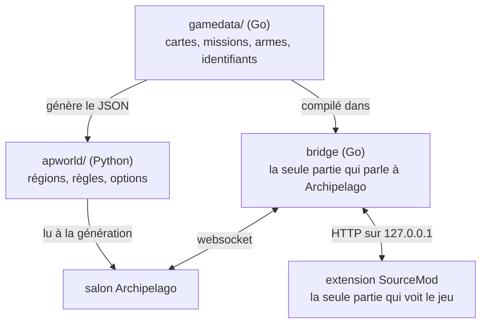

# Le dépôt

Ce que contient chaque répertoire, pourquoi Mann vs Machine est le mode qui
convient, et les commandes qui construisent le projet.

## Pourquoi Mann vs Machine

MvM est le seul mode de TF2 qui contient une progression :

- Une mission est une suite ordonnée de vagues.
- Une équipe réussit une vague, ou elle échoue.
- Une boutique vend des améliorations qui restent acquises.
- Une partie est une suite ordonnée de missions.

Cette structure correspond directement aux régions et aux emplacements
d'Archipelago. Le TF2 classique n'a rien de tout cela : aucun ordre, aucune
condition, rien qui reste acquis.

## Les trois processus



L'extension SourceMod est la seule partie qui voit le jeu. Le pont Go est la
seule partie qui parle à Archipelago. `gamedata/`, en Go, est la seule partie qui
sait ce qu'est une mission ou une arme. Il exporte ces données en JSON, et
l'apworld Python lit ce JSON quand il génère une graine.

Le lanceur Windows exécute le pont dans son propre processus, à côté du serveur
de jeu. La pile compose les exécute dans deux conteneurs. Les joueurs se
connectent avec un client TF2 standard et n'installent rien.

[ADR 0001](./adr/0001-go-owns-the-game-data.md) et
[ADR 0002](./adr/0002-server-side-plugin-with-a-go-bridge.md) expliquent ce
découpage et ce que coûtaient les autres solutions.

## Les répertoires

| Répertoire | Langage | Rôle |
| --- | --- | --- |
| `gamedata/` | Go | Source de vérité : cartes, missions, vagues, armes, améliorations, robots et identifiants. Exporte le JSON. |
| `bridge/` | Go | Client Archipelago. WebSocket, reconnexion, file durable, et une API HTTP en boucle locale pour l'extension. |
| `fakeroom/` | Go | Le multimonde d'un seul joueur que sert le mode test, avec des joueurs simulés. |
| `apworld/` | Python | Un apworld mince. Il lit le JSON exporté et définit les régions, les règles et les options YAML. |
| `plugin/` | SourcePawn | Détecte les objectifs. Applique les déblocages. |
| `launcher/` | Go | L'exécutable Windows : une fenêtre sur le pont et le serveur, l'installateur, le pilote du générateur de graines. |
| `deploy/` | Compose, shell | Les images, les fichiers compose et la construction des bots défenseurs. |
| `docs/` | Markdown | Le livre, en anglais et en français. Spécification, ADR, état de l'art et le fil Discord d'origine. |

## Construire le projet

`make help` liste toutes les cibles. Voici les plus utilisées :

```sh
make check        # tout ce que la CI exécute
make integration  # Archipelago et le pont réels, pilotés comme l'extension le fait
make launcher     # compile tf2ap.exe dans dist/
make bots         # prépare les bots défenseurs que l'image et l'exécutable portent
```

`deploy/env/versions.env` contient toutes les versions que ce projet fixe, sauf
celle de Go. Celle-ci est la ligne `go` de `go.mod`, parce que cette directive
doit être une valeur littérale.
