# Le lanceur, onglet par onglet

Le lanceur est une page dans votre navigateur. Elle a un en-tête, quatre
onglets et huit pages de réglages. Cette page les passe tous en revue. Les
images viennent d'une partie de test, donc les noms et les nombres sont des
exemples.

## L'en-tête

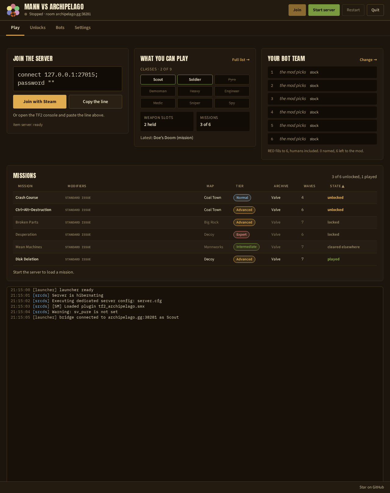

L'en-tête est sur chaque onglet.

- **La ligne d'état**, sous le titre : `Stopped` ou `Running`, l'adresse de
  la room, et la mission en cours sur le serveur.
- **Join** lance Team Fortress 2 et rejoint ce serveur.
- **Start server** installe ce qui manque, puis démarre le serveur. Pendant
  que le serveur tourne, le bouton s'appelle **Stop server**.
- **Restart** arrête et redémarre le serveur. Utilisez-le après avoir changé
  un réglage que le serveur en cours ne peut pas reprendre.
- **Quit** arrête le serveur et ferme le lanceur. Fermer l'onglet du
  navigateur ne le fait pas.

## L'onglet Play

C'est là que vous passez la soirée. Il a quatre panneaux et le journal.

### Join the server

La ligne de connexion à donner à vos amis, avec le mot de passe du serveur si
vous en avez mis un. **Join with Steam** lance le jeu sur cette machine et
rejoint. **Copy the line** copie la ligne dans le presse-papiers.

`item server: ready` sous les boutons veut dire que le serveur de jeu répond.
Voir [Inviter vos amis](invite-your-friends.md) pour ce que la ligne affiche
quand des amis rejoignent par internet.

### What you can play

L'état de la partie en ce moment :

- les neuf classes, les verrouillées barrées,
- combien d'emplacements d'arme la partie a,
- combien de missions sont débloquées,
- le dernier objet reçu.

**Full list** ouvre l'[onglet Unlocks](#longlet-unlocks).

### Your bot team

Les six places de RED, avec la classe et l'équipement de chacune. **Change**
ouvre l'[onglet Bots](#longlet-bots).

### Missions

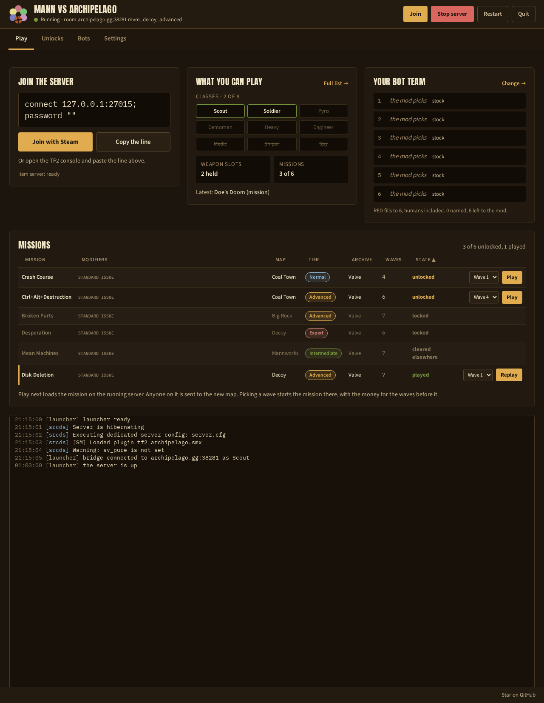

Une ligne par mission de la partie, avec sa carte, son palier, son nombre de
vagues et son état :

| État | Sens |
| --- | --- |
| **unlocked** | La partie a le ticket. Vous pouvez la jouer. |
| **locked** | Le ticket est encore quelque part dans le multiworld. |
| **played** | Votre équipe l'a réussie. |
| **cleared elsewhere** | La libération d'un autre joueur l'a marquée réussie. |

Pendant que le serveur tourne, une mission débloquée a un menu de vague et un
bouton **Play**. **Play** charge cette mission sur le serveur en cours. Toute
personne sur le serveur part sur la nouvelle carte. Choisir une vague
commence la mission là, avec l'argent que l'équipe aurait gagné dans les
vagues d'avant. **Replay** fait pareil pour une mission déjà réussie.

La colonne **Modifiers** montre les modificateurs que la seed a donnés à la
mission, quand [Mission modifiers](shape-of-the-run.md#mission-modifiers) est
activé.

### Le journal

Tout ce que le lanceur, le serveur de jeu et le bridge affichent, avec l'heure
et la source entre crochets.

- Le champ **rcon** en bas envoie une commande au serveur de jeu. Appuyez sur
  Entrée. La flèche haut parcourt votre historique. Voir
  [Commandes de chat](../play/chat-commands.md#pour-lhébergeur).
- **Follow the newest lines** garde le journal en bas.
- **Filter the log** ne montre que les lignes qui contiennent ce que vous
  tapez.
- **Save debug logs** télécharge un zip avec le journal, vos réglages sans
  mot de passe et le fichier joueur. Envoyez-le quand vous demandez de
  l'aide.
- **Clear this view** vide l'écran. Le fichier sur le disque garde tout.

## L'onglet Unlocks

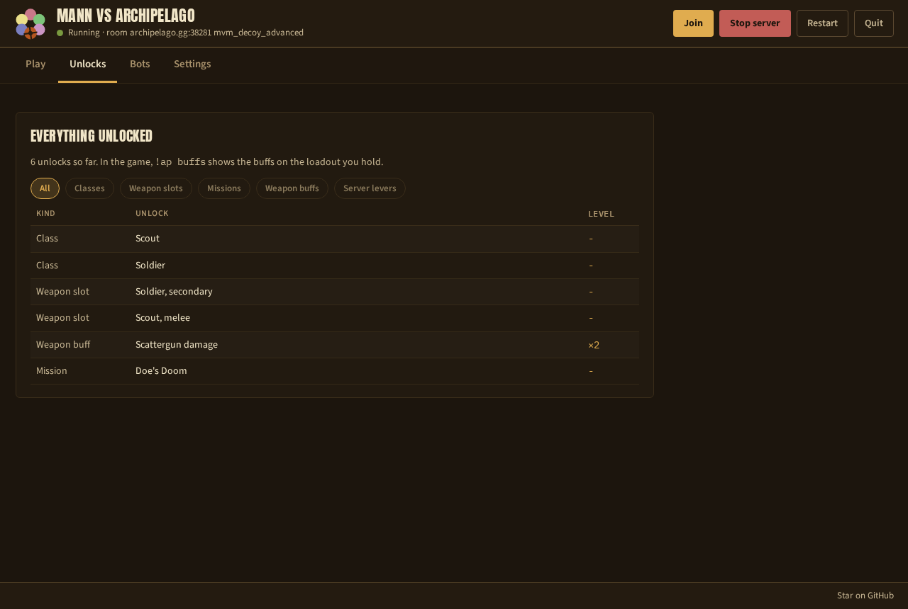

Tout ce que le multiworld a donné à votre serveur, dans un seul tableau. Les
boutons au-dessus filtrent par type : classes, emplacements d'arme, missions,
bonus d'arme et leviers du serveur. La colonne **Level** montre combien de
fois un bonus s'est empilé.

Les joueurs voient la même liste dans le jeu avec `!ap status`, et les bonus
de leur propre équipement avec `!ap_buffs`.

## L'onglet Bots

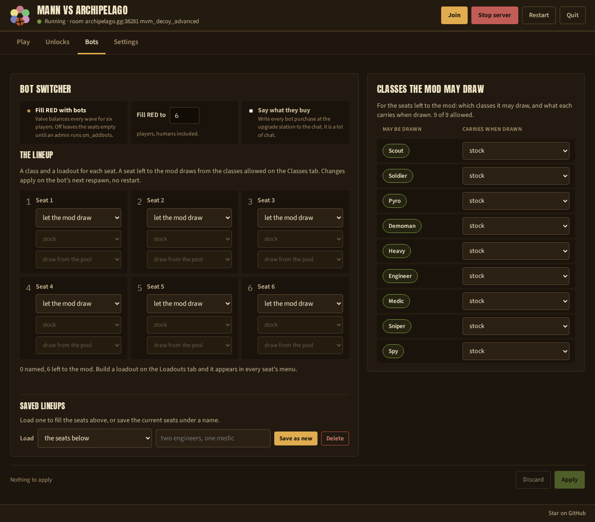

L'équipe de bots, et le seul onglet où un changement atteint le serveur en
cours sans redémarrage.

- **Fill RED with bots** active ou désactive les bots.
- **Fill RED to** est la taille de l'équipe, humains compris.
- **Say what they buy** écrit chaque achat des bots dans le chat.
- **The lineup** a une carte par place avec trois menus : la classe,
  l'équipement et le nom. Une place laissée sur **let the mod draw** prend
  une classe dans la liste de droite.
- **Saved lineups** charge une équipe enregistrée, ou enregistre les places
  actuelles sous un nom.
- **Classes the mod may draw** est la liste de droite. Le mod y pioche pour
  les places que vous n'avez pas nommées. Elle dit aussi ce qu'un bot de
  chaque classe porte.

Appuyez sur **Apply** pour envoyer le changement au serveur. Le mod ne
remplace que les places dont la classe a changé, à la pause suivante entre
deux vagues. **Discard** abandonne vos modifications.

Voir [Les bots de votre équipe](../play/defender-bots.md) pour ce que les bots
font.

## L'onglet Settings

Les réglages tiennent sur huit pages. La liste à gauche passe de l'une à
l'autre, et **Search settings** trouve une ligne par son nom sur n'importe
quelle page.

Chaque page a le même pied :

- **Previous** et **Next** parcourent les pages dans l'ordre.
- **Discard** abandonne les modifications de toutes les pages.
- **Save** les écrit. Le libellé entre les boutons dit s'il reste quelque
  chose de non enregistré.

Un changement enregistré que le serveur en cours ne peut pas reprendre
affiche un avis avec un bouton **Restart to apply**. Redémarrez quand vos
joueurs sont entre deux vagues.

### 1. Player options

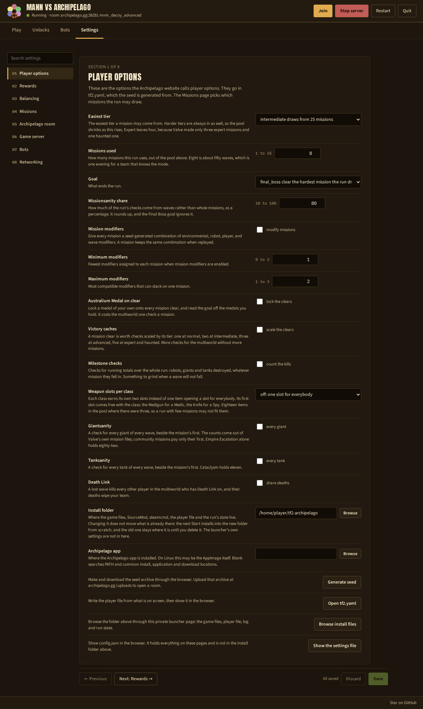

Les options de la seed Archipelago. Elles vont dans `tf2.yaml`, et
**Generate seed** construit la seed à partir d'elles. Chaque ligne est
expliquée dans [Les options de la partie](shape-of-the-run.md#la-partie).

Le bas de la page a les dossiers et les actions :

- **Install folder** est l'endroit des fichiers de jeu. Changez-le pour
  utiliser un autre disque. Le prochain **Start** installe là depuis zéro.
- **Archipelago app** est l'endroit où l'application Archipelago est
  installée. Laissez-le vide et le lanceur cherche aux endroits habituels.
- **Generate seed** écrit le fichier joueur, lance le générateur Archipelago
  et vous donne l'archive à envoyer. Voir [Créer la session](create-the-session.md).
- **Open tf2.yaml** montre le fichier joueur que le lanceur écrirait.
- **Browse install files** ouvre le dossier d'installation dans le
  navigateur.
- **Show the settings file** ouvre `config.json`, qui contient tout ce qui
  est sur ces pages.

### 2. Rewards

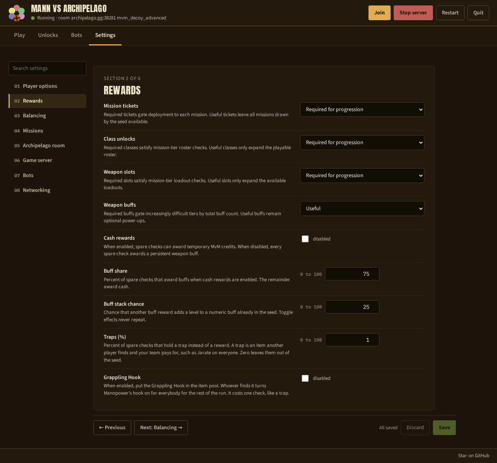

Ce qui remplit les checks qui restent après les classes, les emplacements et
les tickets, et quels objets peuvent bloquer la progression. Voir
[Les options de la partie](shape-of-the-run.md#récompenses).

### 3. Balancing

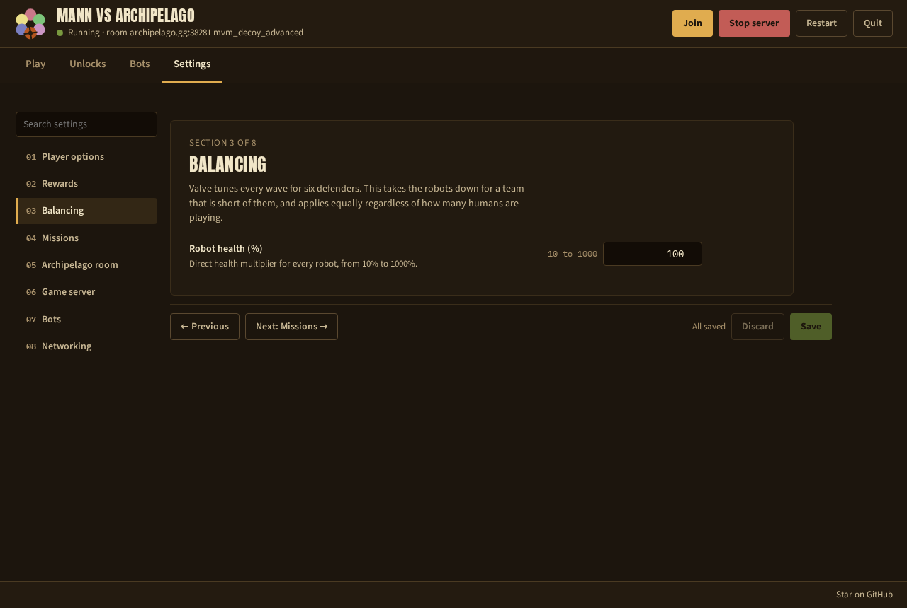

Une seule ligne, **Robot health (%)**. Elle met à l'échelle la santé de chaque
robot, pour une équipe de moins de six. C'est un réglage du serveur, pas une
option de la seed, donc il s'applique au prochain chargement de carte. Voir
[Une équipe réduite](../play/defender-bots.md#une-équipe-réduite).

### 4. Missions

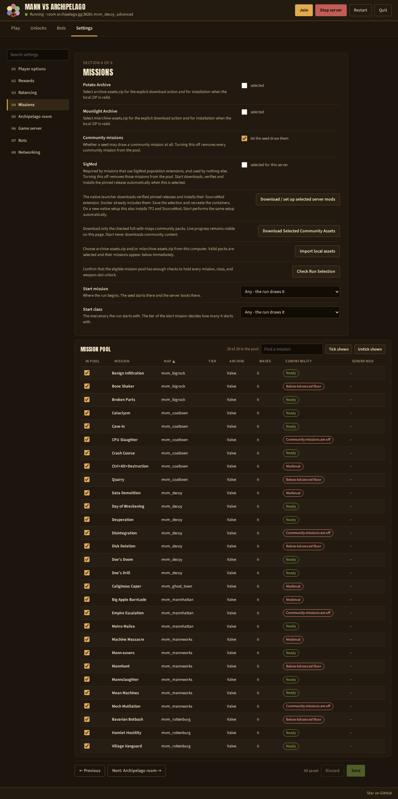

Les missions où la seed peut piocher, et où la partie commence.

- **Potato Archive** et **Moonlight Archive** sélectionnent les paquets de
  contenu communautaire. **Download Selected Community Assets** les
  télécharge. **Start** ne télécharge jamais de contenu communautaire tout
  seul.
- **Community missions** laisse la seed piocher des missions communautaires.
- **SigMod** et les autres mods serveur : choisissez **off**,
  **only when a mission needs it** ou **always, on every mission**. Appuyez
  ensuite sur **Download / set up selected server mods**. Une mission qui
  demande un mod reste hors de la réserve tant que ce mod est sur off. Voir
  [Les options de la partie](shape-of-the-run.md#les-missions).
- **Check Run Selection** vous dit si la réserve contient assez de checks
  pour les objets de la partie. Appuyez dessus avant de générer.
- **Start mission** et **Start class** décident où la partie commence.
- **Mission pool** est le tableau du bas : une ligne par mission, avec une
  case pour la mettre dans la réserve. **Find a mission** filtre le tableau.
  **Tick shown** et **Untick shown** agissent sur les lignes filtrées. La
  colonne **Compatibility** dit pourquoi une mission ne peut pas être piochée
  pour l'instant, par exemple `Below Advanced floor` ou
  `Community missions are off`.

Voir [Les missions](shape-of-the-run.md#les-missions).

### 5. Archipelago room

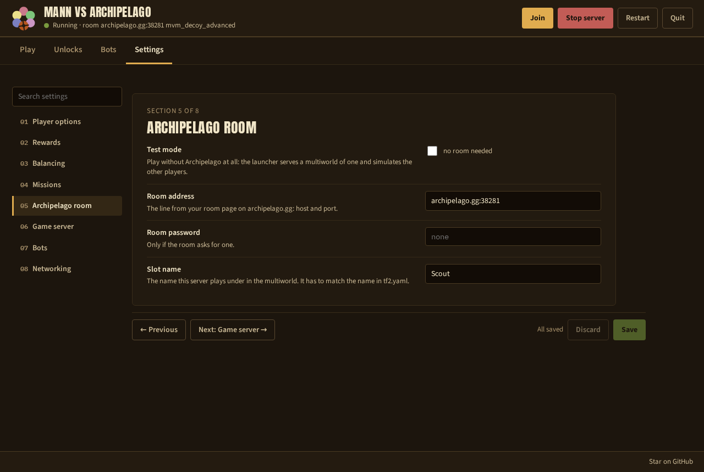

- **Test mode** joue sans room. Le lanceur simule un multiworld d'un seul
  joueur.
- **Room address** est la ligne de la page de la room, `hôte:port`.
- **Room password**, seulement si la room en demande un.
- **Slot name** est le nom de votre serveur dans le multiworld. Il doit être
  le même que le `name` du fichier joueur.

Voir [Créer la session](create-the-session.md).

### 6. Game server

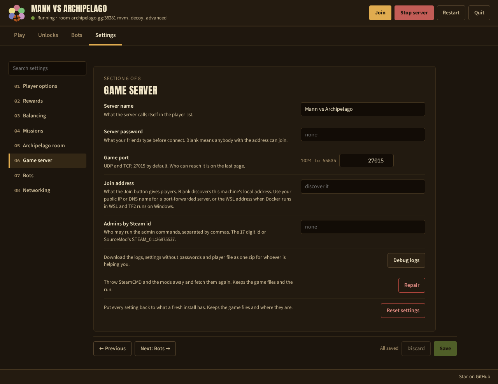

- **Server name**, **Server password** et **Game port** sont ce que vos amis
  voient et tapent.
- **Join address** est l'adresse de la ligne Join. Vide trouve l'adresse
  locale de cette machine. Mettez votre adresse publique pour un port
  redirigé.
- **Admins by Steam id** décide qui peut changer de mission et de bots depuis
  le chat. Voir [Commandes de chat](../play/chat-commands.md#pour-ladmin).
- **Debug logs** télécharge le même zip que le bouton de l'onglet Play.
- **Repair** jette SteamCMD et les mods et les réinstalle. Il garde les
  fichiers de jeu et la partie.
- **Reset settings** remet chaque réglage à sa valeur par défaut. Il garde les
  fichiers de jeu.

### 7. Bots

La page Bots a cinq sous-onglets.

#### Team

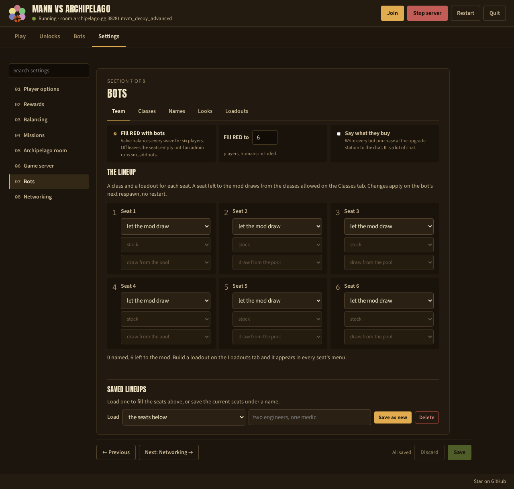

La même équipe que l'[onglet Bots](#longlet-bots), enregistrée comme réglage.
Utilisez cette page avant le démarrage du serveur, et l'onglet Bots pendant
qu'il tourne.

#### Classes

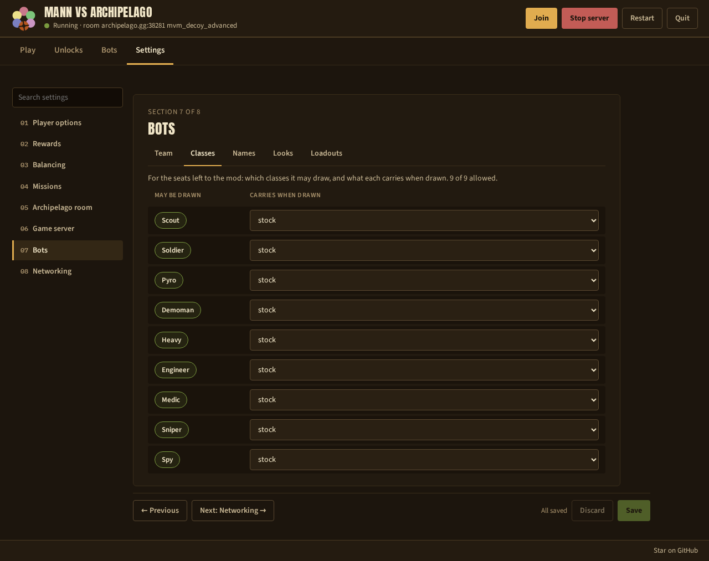

Pour les places laissées au mod : quelles classes il peut piocher, et ce
qu'un bot de chaque classe porte. Décochez Sniper et Spy si vous voulez les
bots sur les classes qu'ils jouent bien.

#### Names

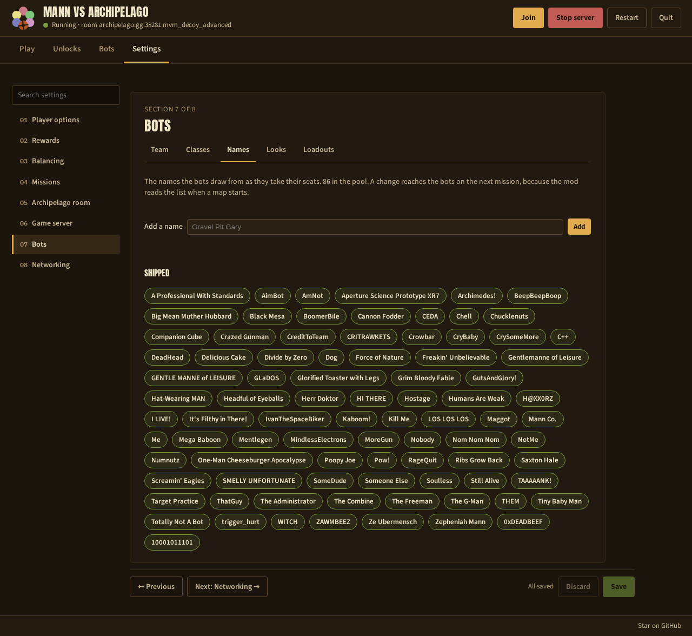

Les noms que les bots prennent. **Add a name** en ajoute un à la réserve.
Cliquez sur un nom livré pour l'écarter. Un changement atteint les bots à la
mission suivante.

#### Looks

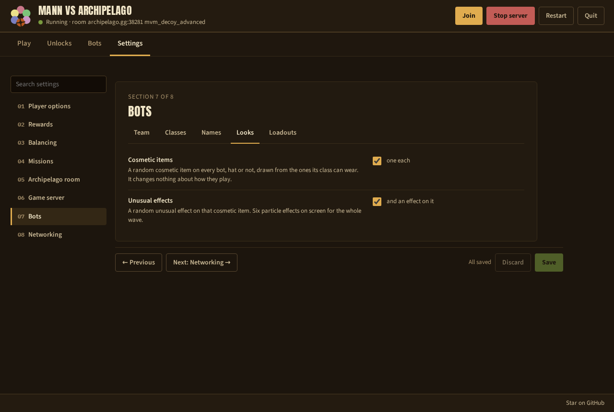

**Cosmetic items** donne à chaque bot un objet cosmétique au hasard que sa
classe peut porter. **Unusual effects** y ajoute un effet de particules. Ni
l'un ni l'autre ne change la façon dont un bot joue.

#### Loadouts

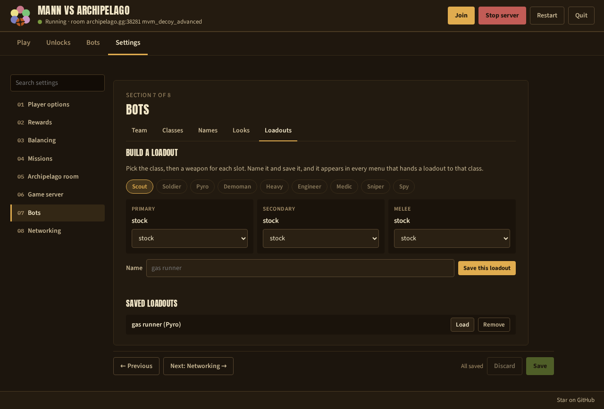

Construisez un équipement : choisissez une classe, une arme par emplacement
et un nom. **Save this loadout** l'ajoute à chaque menu qui donne un
équipement à cette classe. **Saved loadouts** liste ceux que vous avez
construits, avec **Load** pour en modifier un et **Remove** pour le
supprimer.

### 8. Networking

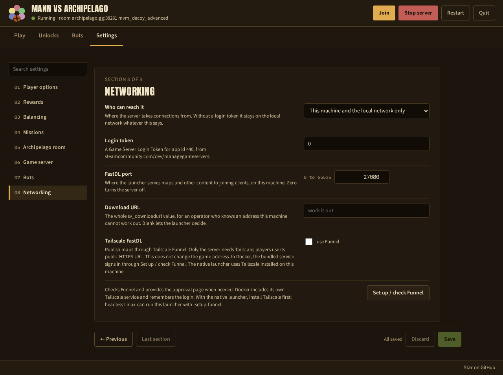

- **Who can reach it** : le réseau local, un port redirigé ou le relais Steam.
  Voir [Inviter vos amis](invite-your-friends.md).
- **Login token** : le jeton de serveur de jeu Steam. Nécessaire pour tout
  sauf le réseau local.
- **FastDL port** et **Download URL** : d'où les joueurs qui rejoignent
  téléchargent les cartes communautaires.
- **Tailscale FastDL** et **Set up / check Funnel** : publier ces
  téléchargements par Tailscale. Voir
  [Téléchargement rapide des cartes avec Tailscale](tailscale-fastdl.md).

Suite : [Créer la session](create-the-session.md).
