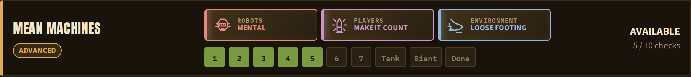

# Visual campaign tracker

The tracker is a second entry point in the launcher's Angular workspace. It
shares the launcher's design tokens, fonts and UI components, but reads
Archipelago's public tracker APIs instead of the launcher's loopback API.
Viewers do not need the room password and the built page needs no server
application.

Use the copy hosted by this repository at
<https://m-this.github.io/tf2-archipelago/tracker/>.

## Try it locally

Build it and serve the generated static directory:

```sh
make tracker-build
python3 -m http.server -d dist/tracker 8000
```

Open <http://localhost:8000/> and either:

- paste the room URL from `archipelago.gg`;
- paste its standard tracker URL or compact tracker ID; or
- choose **View sample run** to explore the interface without a room.

Select a TF2 slot when a multiworld contains more than one. Click a class icon
to see the weapon buffs that class can equip, their individual stack counts,
and the combined level for each weapon. A live tracker refreshes once a minute;
**Refresh** updates it immediately.

The sample run puts Mental and Make it Count together on Mean Machines:



## Publish it as a static page

Publish the contents of this directory:

```text
dist/tracker/
```

The build copies the generated mission and weapon catalogues beside the app and
uses relative asset URLs, so the directory works at any static URL. The page
falls back to the catalogues on this repository's `main` branch when the local
copies are unavailable. TF2 class and item icons load from the Official Team
Fortress Wiki.

The `pages` job in `.github/workflows/ci.yml` builds the tracker after every
successful push to `main`, puts it at `tracker/` beside the documentation, and
deploys both as one GitHub Pages artifact. A fork using the same workflow gets
its own copy at `https://OWNER.github.io/REPOSITORY/tracker/` after selecting
**GitHub Actions** as its Pages source.

Rooms must have tracking enabled. Seeds made with an older apworld do not put
their precollected inventory in public slot data, so randomly selected starting
classes can appear locked. Generate a new seed with the apworld from this branch
to include that inventory.

## How it gets its data

The page calls Archipelago's public room-status, static-tracker, slot-data,
tracker-state, and datapackage endpoints. It does not connect to the TF2 server
or the bridge and it never sends a room password.

Mission metadata comes from `missions.json`. `weapon_classes.json` is generated
from the same Go weapon catalogue used by the launcher and plugin, which keeps
the class popup aligned with weapons each class can actually equip. Regenerate
both catalogues after changing gamedata:

```sh
go generate ./gamedata
```
